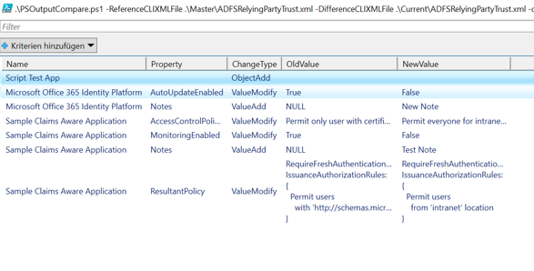

# PowerShell Output Compare (Config Checker)
A PowerShell script that compares saved CLIXML output of an PowerShell command and shows all changes.

<b>Usage: PSOutputCompare.ps1 -ReferenceCLIXMLFile {master.xml} -DifferenceCLIXMLFile {current.xml} -ObjectIdentifier {AttributeName} -NameAttribute {AttributeName}</b> 

Sample output of an compare of Get-ADFSRelyingPartyTrust saved before and after some changes: 

Saved CliXML output of a cmdlet can contain an object or an object collection. 
First step all added or removed objects are shown in the output. 
Output column **ChangeType** will have the following values: 
* ObjectAdd
* ObjectRemove
 
Second step all changed properties of an still existing objects are show. 
Output column **ChangeType** will have the following values: 
* ValueAdd
* ValueRemove
* ValueModify
